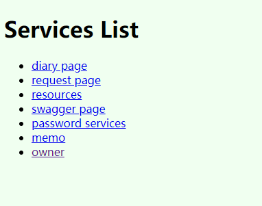
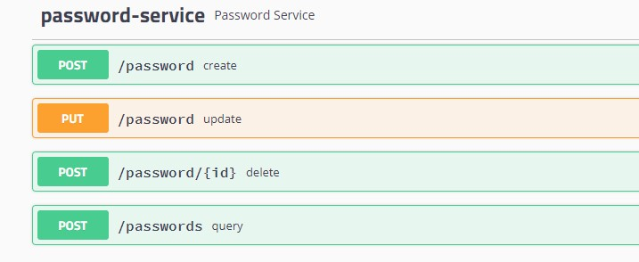
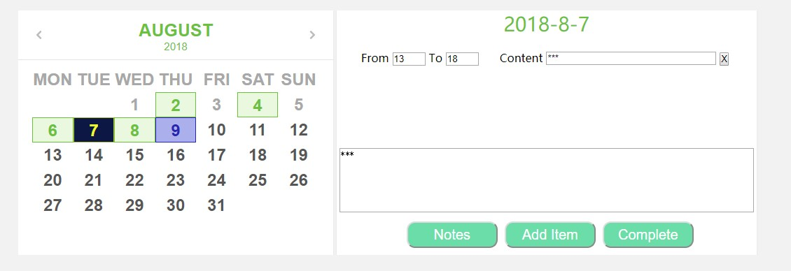
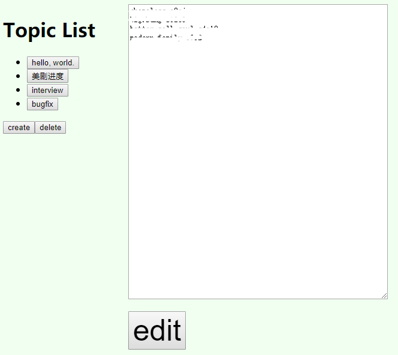

Shane
=====

### Features
- Manage encrypted passwords.
- Record works for time management.
- Back up resources.
- Write down memos grouped by topics.

### Usage

#### Home Page

#### Passwords Page
Use swagger (new passwords service page is still ongoing):

#### Diary Page

#### Memo Page

#### Resources Path
    /resources

### Notes
No middleware and no database.

Created only based on spring boot and jdk8.

Visit [shaneu.cn](http://shaneu.cn).